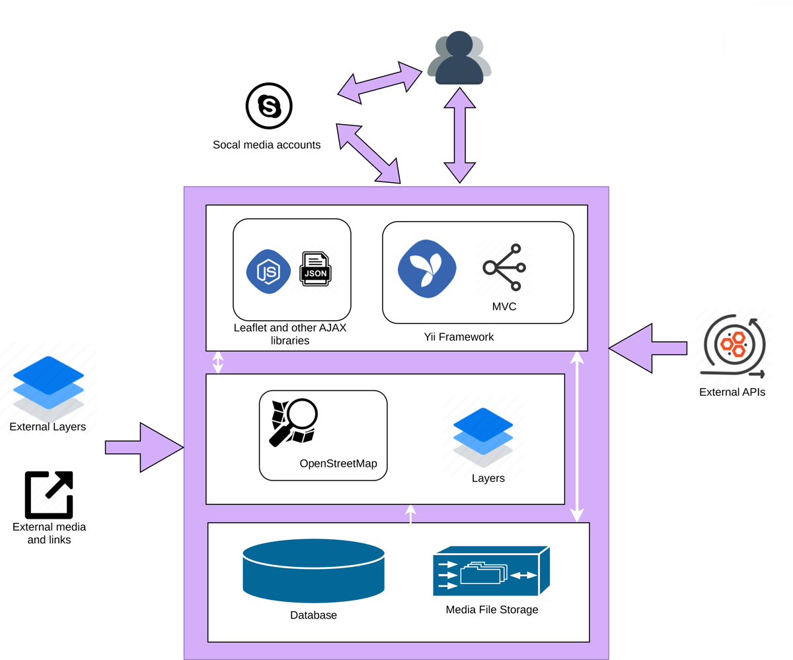
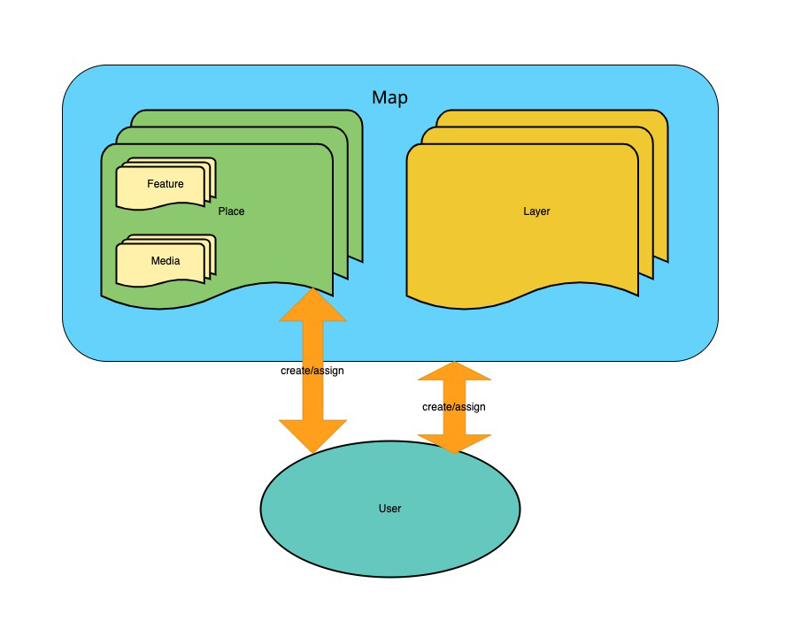

<p align="center">
    <a href="https://github.com/yiisoft" target="_blank">
        
    </a>
    <h1 align="center">Defining Map System</h1>
    <br>
</p>

The defining map system is an application designed for collaborative map creation for research or community projects with mapping requirements. The system offers features that are limited or restricted in other mapping applications, such as collaborative mapping and the ability to reuse data. It is designed to facilitate seamless collaborations between different users who could include researchers, students, curators, and community members to develop datasets and project material via a shared interface.

The architecture of the defining map system is illustrated in the diagram below. At the foundation, data are stored in a relational database such as MySQL or PostgreSQL; media such as images and videos are stored in file storage. The system’s base map uses the OpenStreetMap service (https://www.openstreetmap.org/). Layers can be added to the map from an external layer service such as MapWarper (https://mapwarper.net/). External media and links can also be added to the place for a map. The top level of the system is comprised of the Yii framework (https://www.yiiframework.com/) and other essential libraries, such as Leaflet (https://leafletjs.com/). Users can use their social media accounts to create accounts and log in to access the system. System user accounts can also be created without social media accounts. External APIs can be added and utilised for content creation. Both map and place lists can be selected and exported as JSON files. The point, line, and polygon features of places will be included in the JSON file in the open standard GeoJSON format (https://en.wikipedia.org/wiki/GeoJSON)) for interoperability with other platforms. <br/>


The component diagram below illustrates the connections between the map, places, media, layers, and users. The map comprises both places and layers. Features like points, lines, areas, or polygons on the map, as well as media types such as images and videos, can be associated with a place. A single map can contain multiple places or layers, and a place can accommodate various features or media items. Users have the flexibility to create maps or places, assign them to collaborators, or designate them as editable and linkable for all. <br/>


Please find further details in the "Defining Map System for Collaborative Map Creation and Data Reuse" paper, [Demo](https://cdhr-enki.anu.edu.au/defining/frontend/web/), and[Docs](docs/index.html).

# Requirements
Yii 2.0 <br/>
PHP 5.6+ <br/>
MYSQL 5.5+ <br/>

# Installation
The system was built with the Yii framework (http://www.yiiframework.com/) and Yii Advanced Project Template (https://www.yiiframework.com/extension/yiisoft/yii2-app-advanced). 

## Composer
```
composer install
```
Please refer to Yii 2.0 (https://www.yiiframework.com/doc/guide/2.0/en/start-installation) and extensions (https://www.yiiframework.com/doc/guide/2.0/en/structure-extensions) for their installation steps. 


## Apply Migration
```
yii migrate
```
Please refer to Yii 2.0 Migration (https://www.yiiframework.com/doc/guide/2.0/en/db-migrations#applying-migrations), or use SQL file. 

## Vagrant and Docker
Please refer to https://github.com/yiisoft/yii2-app-advanced/blob/master/docs/guide/start-installation.md

For customisation or configuration, please refer to the Yii guide (https://www.yiiframework.com/doc/guide/2.0/) and Yii Advanced Template guide (https://github.com/yiisoft/yii2-app-advanced).

# Update

## Minor Update single extension or core
```
composer require extension-name-version
```
Example:
```
composer require "yiisoft/yii2:~2.0.50" 
```
## Major update for all extensions and core
```
composer update 
```
## Check and audit extension version and security
```
composer show
composer audit
```
<br/>

[](https://doi.org/10.5281/zenodo.14759341)
<br/>
[](https://fairsoftwarechecklist.net/v0.2?f=31&a=32113&i=31222&r=123)